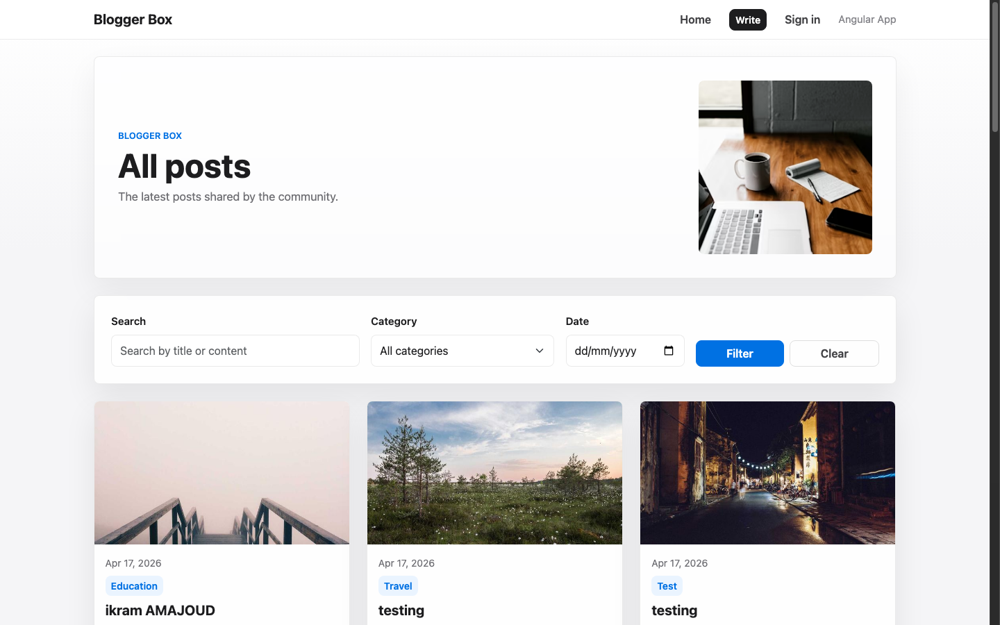
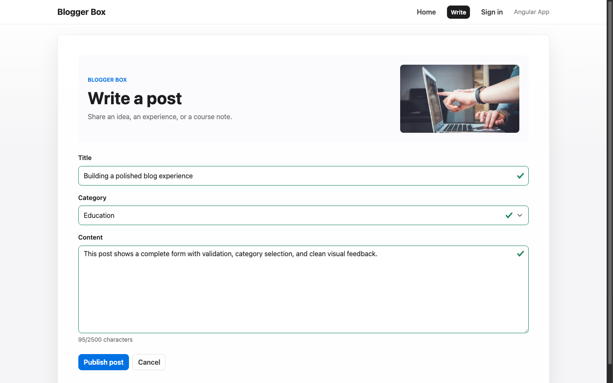
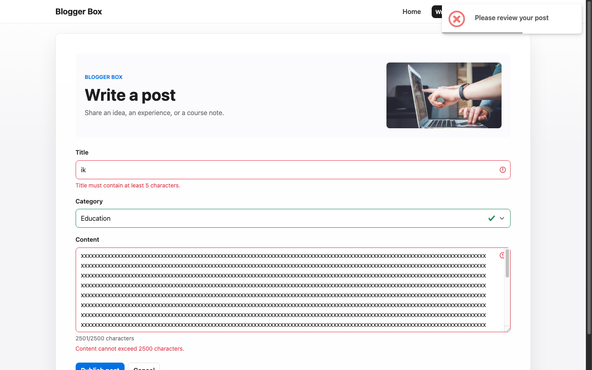
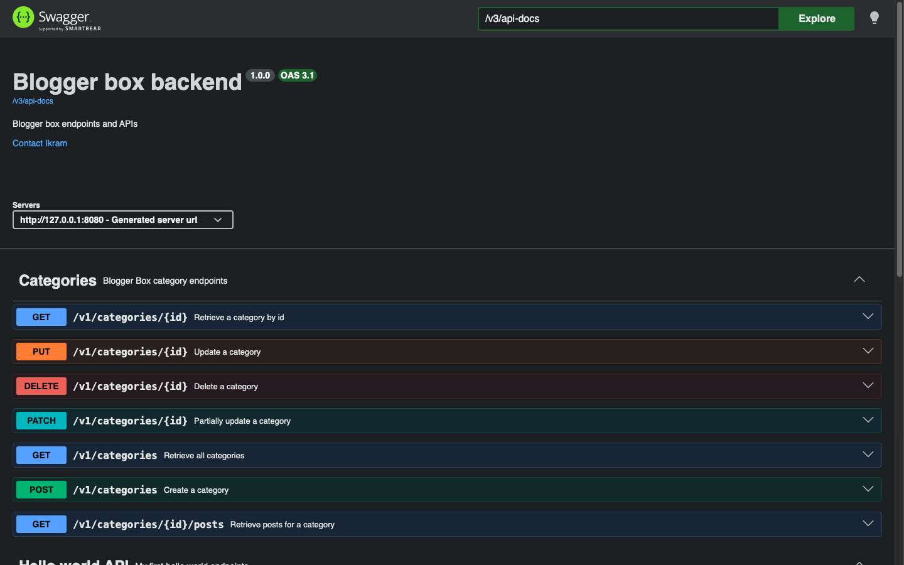

# Blogger Box Frontend

Angular frontend for the Blogger Box application. The app consumes the Spring Boot REST API and provides a clean blog interface to browse, create, edit, delete, and filter posts.

## Features

- Apple-inspired responsive UI
- Home page with post cards
- Post creation form
- Post detail page
- Edit and delete post actions
- Filters by search text, category, and date
- Categories loaded from the backend
- Reactive form validation
- SweetAlert2 confirmations and toast messages
- Angular proxy configuration for local backend calls
- Demo Sign In page showing Angular reactive forms

## Tech Stack

- Angular
- TypeScript
- Bootstrap
- SweetAlert2
- RxJS

## Run Locally

Start the backend first:

```bash
cd /Users/ikram/Desktop/blogger-box-backend
mvn spring-boot:run -Dspring-boot.run.arguments=--spring.profiles.active=test
```

Then start the frontend:

```bash
cd /Users/ikram/blogger-box-frontend
npm start -- --host 127.0.0.1 --port 4201 --proxy-config proxy.conf.cjs
```

Open:

```text
http://127.0.0.1:4201
```

## Build

```bash
npm run build -- --progress=false
```

## Routes

- `/` - post list and filters
- `/add-post` - create post form
- `/posts/:id` - post detail and edit page
- `/sign-in` - demo reactive form page

## About The Sign In Page

The Sign In page is included to demonstrate Angular reactive forms, validation, routing, and SweetAlert notifications. It does not implement real authentication because the backend scope of this project focuses on posts and categories.

## Screenshots

### Home Page



### Create Post



### Form Validation



### Post Detail


### Swagger API



## GitHub

Repository:

```text
https://github.com/ikramajd/blogger-box-frontend
```
